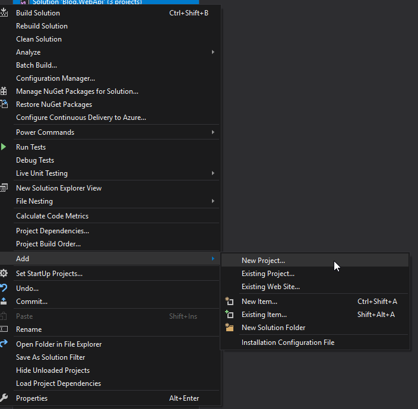
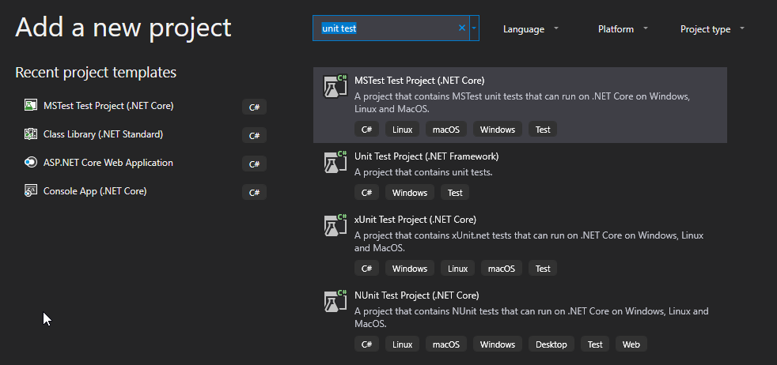
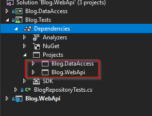

# Model Application Persistence using EF Core

## Module 3

### Repositories

A repository can be a great way to encapsalate queries to your database. A repository
layer allows you to give meaningful names to complicated queries.
It's also a good way to demonstrate dependency injection and unit testing which is why
we are doing it here.

I also took the opportunity to separate the projects. Instead of each project living
inside of the web api, the data access layer has been removed and placed into it's own
project.

### Blog.WebApi

Holds the application layer. This is the project with the "Main" component. Notice
also that this project no longer needs to reference EntitiyFrameworkCore! This means
all of our database access logic is contained in another project.

> The Main component is the ultimate detail—the lowest-level policy. It is the initial entry point of the system. Nothing, other than the operating system, depends on it. Its job is to create all the Factories, Strategies, and other global facilities, and then hand control over to the high-level abstract portions of the system.
>
> It is in this Main component that dependencies should be injected by a Dependency Injection framework. Once they are injected into Main, Main should distribute those dependencies normally, without using the framework.
>
> Think of Main as the dirtiest of all the dirty components.
>
> Reference: "Clean Architecture" - Robert Martin

### Blog.DataAccess

This project will hold the EntityFramework entities as well as concrete implementations
of the Repository classes. To create or update the database schema, you still run
`Update-Database` in the Package Management Console, but you need to set the Default
project to `Blog.DataAccess`.
Open the Package Manager Console now.
Set the Default project to `Blog.DataAccess` and run `Update-Database`.

This will create your database and setup the schema properly.


## Add Unit tests to the Solution

### Create a Unit Test project

Right click on the solution and add a new project.



Search for unit test and add a new MSTest project.



After the project is created it will automatically put a unit test class
named `UnitTest1.cs`. Go ahead and rename that file to `BlogRepositoryTests.cs`.
When Visual Studio asks, rename the class as well.

From the UnitTest project we are going to need to add a reference to the
`Blog.DataAccess` and the `Blog.WebApi` projects.



### Test BlogRepository constructor

The `BlogRepository` constructor throws an exception if no `BlogContext`
is passed in.

<details>
<summary>BlogRepository.cs</summary>

```cs
public BlogRepository(BlogContext blogContext)
{
    this.blogContext = blogContext ?? throw new ArgumentNullException(nameof(blogContext));
}
```

</details>

This is pretty simple to test for. Inside of the `BlogRepositoryTests` create
a new test method that passes null into the constructor. The test should expect
an exception to be throw. If an exception is _not_ thrown, the `Assert.Fail();`
line will fail the test right away. Name the test `NullContextThrowsException`.

<details>
<summary>NullContextThrowsException()</summary>

```cs
[TestMethod]
[ExpectedException(typeof(ArgumentNullException))]
public void NullContextThrowsException()
{
    var blogRepository = new BlogRepository(null);
    Assert.Fail();
}
```

</details>

### Mock DbContext Test

#### Moq

I am going to include a framework for mocking objects called `Moq`. Moq
allows you to mock objects without having to create concrete implementations.

#### Add the test with Mocks

Now we would like to test the query inside of the repository class.
To do that we are going to need to mock a DbContext object and pass
it into the repository constructor.

Our BlogContext will need to take a DbContextOptions object.
This object suprisingly does not need to be mocked. We can create one
using the an insatnce of `DbContextOptionsBuilder`. Then this can be
passed into the Mock constructor for a `BlogContext`.

Our repository is going to run a query on `Blogs` which will require
us to mock a DbSet<Blog> as well. This is a little more complicated.
We are going to use an object from the [EntityFrameworkCore.Moq](https://github.com/huysentruitw/entity-framework-core-mock)
project. Instead of including the project however I am only going to copy the methods
I want to use and mock.

For now copy this class into the test project so we can use it to mock the DbContext.

<details>
<summary>DbQueryMock.cs</summary>

```cs
public class DbQueryMock<TEntity> : Mock<DbSet<TEntity>> where TEntity : class
{
    private readonly IEnumerable<TEntity> _entities;
    public DbQueryMock(IEnumerable<TEntity> entities)
    {
        _entities = (entities ?? Enumerable.Empty<TEntity>()).ToList();
        var data = _entities.AsQueryable();
        As<IQueryable<TEntity>>().Setup(x => x.Provider).Returns(data.Provider);
        As<IQueryable<TEntity>>().Setup(x => x.Expression).Returns(data.Expression);
        As<IQueryable<TEntity>>().Setup(x => x.ElementType).Returns(data.ElementType);
        As<IQueryable<TEntity>>().Setup(x => x.GetEnumerator()).Returns(() => data.GetEnumerator());
        As<IEnumerable>().Setup(x => x.GetEnumerator()).Returns(() => data.GetEnumerator());
    }
}

```

</details>

Now we can create our test and mock everything we need.
In this test we are creating a repository object, but mocking
the context to return the blog objects we manually create.

<details>
<summary>ReturnAllBlogObjects_Mock_DbContext()</summary>

```cs
[TestMethod]
public void ReturnAllBlogObjects_Mock_DbContext()
{
    var builder = new DbContextOptionsBuilder();
    var options = builder.Options;
    var blogContextMock = new Mock<BlogContext>(options);
    var blogs = new List<DataAccess.Blog>
    {
        new DataAccess.Blog(),
        new DataAccess.Blog()
    };
    var dbSetMock = new DbQueryMock<DataAccess.Blog>(blogs);
    blogContextMock
        .Setup(b => b.Blogs)
        .Returns(dbSetMock.Object);
    var blogRepository = new BlogRepository(blogContextMock.Object);

    var blogEntries = blogRepository.GetAllBlogEntries();

    Assert.AreEqual(2, blogEntries.Count());
}
```

</details>

### In memory database test

Another option is to use an in-memory database. This will create a context just as before, but instead
of accessing sql server express, it will use an in-memory one instead. All we need to do is add
`UseInMemoryDatabase` to our DbContextOptions. Note an InMemory database is not
a relationship database.

> InMemory is not a relational database
> EF Core database providers do not have to be relational databases. InMemory is designed to be a general purpose database for testing, and is not designed to mimic a relational database.
>
> Some examples of this include:
>
> - InMemory will allow you to save data that would violate referential integrity constraints in a relational database.
> - If you use DefaultValueSql(string) for a property in your model, this is a relational database API and will have no effect when running against InMemory.
> - Concurrency via Timestamp/row version ([Timestamp] or IsRowVersion) is not supported. No DbUpdateConcurrencyException will be thrown if an update is done using an old concurrency token.

[microsoft in memory docs][in-memory docs]

Copy and past the test below.
This test will create a new in memory database with the given `databaseName`. We can read from and write to it just like a normal database.
Manually this test adds a blog entry to the database, and then uses the repository to retrieve it.

<details>
<summary>InMemory_Repository_Integration()</summary>

```cs
[TestMethod]
public void InMemory_Repository_Integration()
{
    var options = new DbContextOptionsBuilder()
        .UseInMemoryDatabase(databaseName: "repositoryDb")
        .Options;
    using (var context = new BlogContext(options))
    {
        var blogRepository = new BlogRepository(context);
        var blogEntries = blogRepository.GetAllBlogEntries();
        Assert.AreEqual(0, blogEntries.Count());
        context.Blogs.Add(new DataAccess.Blog());
        context.SaveChanges();
        blogEntries = blogRepository.GetAllBlogEntries();
        Assert.AreEqual(1, blogEntries.Count());
    }
}
```

</details>

### Copy the in memory test

Copy and paste the `InMemory_Repository_Integration()` method and rename it.
Run all unit test.
Notice that one of them fails now. What happened?
It's because the in memory database is still alive within the same test run. We want to keep our tests separate
and if we are going to mock the database in this way, we are going to need to create unique
names for each test so they do not run into eachother.

Give the second test a new database name.
Both tests that use a in memory database should be passing now.

### Test the controller directly

The real reason to create a repository is that we can test components that use it
without having to worry about mocking the DbContext objects. Let's test the controller
and pass in a mocked `BlogRepository` object. We can assume the repository is going to
return what we want.

<details>
<summary>ReturnAllBlogObjects_Mock_Repository()</summary>

```cs
[TestMethod]
public void ReturnAllBlogObjects_Mock_Repository()
{
    var blogRepository = new Mock<IBlogRepository>();
    blogRepository
        .Setup(b => b.GetAllBlogEntries())
        .Returns(new List<DataAccess.Blog> { new DataAccess.Blog() });
    var blogController = new BlogController(blogRepository.Object);
    var blogResult = blogController.Get().Result as OkObjectResult;
    Assert.IsNotNull(blogResult);
    var returnedBlogEntries = blogResult.Value as IEnumerable<DataAccess.Blog>;
    Assert.IsNotNull(returnedBlogEntries);
    Assert.AreEqual(1, returnedBlogEntries.Count());
}
```

</details>

### Integration test with InMemory Database

Another option we have is to create concrete objects of our components and test the integrations
using an in memory database.
Since this test is still really testing a retrieve, it will first add an object to the database
manually, and then using a _controller_ retrieve the response.

This test creates a _concrete_ repository, a _concrete_ controller and mocks the database. It is an
example of how to test the integration between components.

<details>
<summary>InMemory_Controller_Integration()</summary>

```cs
[TestMethod]
public void Inmemory_Controller_Integration()
{
    var options = new DbContextOptionsBuilder()
        .UseInMemoryDatabase(databaseName: "controllerDb")
        .Options;
    using (var context = new BlogContext(options))
    {
        var blogRepository = new BlogRepository(context);
        var controller = new BlogController(blogRepository);
        var objectResult = controller.Get().Result as OkObjectResult;
        var blogEntries = objectResult.Value as IEnumerable<DataAccess.Blog>;
        Assert.AreEqual(0, blogEntries.Count());
        context.Blogs.Add(new DataAccess.Blog());
        context.SaveChanges();
        objectResult = controller.Get().Result as OkObjectResult;
        blogEntries = objectResult.Value as IEnumerable<DataAccess.Blog>;
        Assert.AreEqual(1, blogEntries.Count());
    }
}
```

</details>

## Review

In this homework we setup a new test project and ran through different
testing options using EF Core. You can choose how you want to test your components
and how many different ways you want to test those components.

[in-memory docs]: https://docs.microsoft.com/en-us/ef/core/miscellaneous/testing/in-memory
[ddd repository]: https://docs.microsoft.com/en-us/dotnet/standard/microservices-architecture/microservice-ddd-cqrs-patterns/infrastructure-persistence-layer-implemenation-entity-framework-core